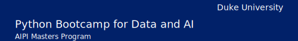

# 

# Python Bootcamp for Data and AI

* Syllabus for [Artificial Intelligence for Product Innovation](https://ai.meng.duke.edu/degree) Master of Engineering
* [AIPI 503: Python and Data Science Bootcamp](https://ai.meng.duke.edu/courses)
* [Rubric](./rubric.md)

### Course Description

In this course, you will learn about the essential Python skills required for success in an MLOps (Machine Learning Operations) role. You will explore the fundamentals of the Python programming language, including data types, functions, modules, and testing techniques. Additionally, you will discover how to effectively work with datasets and perform data science tasks using Pandas and NumPy.

Through a series of hands-on exercises, you will gain practical experience applying Python within the context of an MLOps workflow.

This course is ideal for aspiring MLOps professionals looking to enter the field, as well as beginner programmers that want to know more about Python.

**Faculty**
* [Prof. Alfredo Deza Contact & Bio](https://ene.duke.edu/faculty/alfredo-deza)

  
<b>Table of Contents</b>

   

* [Prerequisites](#prerequisites)
* [Week 1: Python functions and classes](#week-1-python-functions-and-classes)
* [Week 2: Testing in Python ](#week-2-testing-in-python)
* [Week 3: Introduction to Pandas and Numpy](#week-3-introduction-to-pandas-and-numpy)
* [Week 4: Applied Python for MLOps](#week-4-applied-python-for-mlops)
* [Week 5: Buffer week](#week-5-buffer-week)

## Course Objectives

By the end of this course, you will be able to:

* Write Python scripts to automate common MLOps tasks
* Utilize Python's core features and syntax effectively
* Implement functions and modules to organize your code
* Apply testing techniques to ensure code reliability
* Manipulate and analyze data using Pandas and NumPy
* Integrate Python skills into an MLOps workflow
* Deploy a Python-based solution to the cloud
* Develop a non-linear life-long learning skill

> [!NOTE]
> **Diversity Statement:** As educators and learners, we must share a commitment to diversity and equity, removing barriers to education so that everyone may participate fully in the community. In this course, we respect and embrace the unique experiences that brought each person here, including backgrounds, identities, learning styles, ways of expression, and academic interests. The broad spectrum of perspectives represented by our students enrich everyone’s experiences, and we strive to meet each perspective with openness and respect.

### Prerequisites

This course requires basic programming skills, Git,  and an understanding of
the GitHub platform. You will use GitHub repositories with version control. You can complete all coursework without the need to acquire specialized compute resources and just using your browser.

> [!NOTE]
> This course will use Codespaces, a GitHub technology that allows you to use
> Visual Studio Code in the browser. This is _optional_ as you can still use
> Visual Studio Code locally on your computer or any other text editor you feel
> comfortable with.

**GitHub Codespaces**
If you want to learn what Codespaces is and how it works, use this [O'Reilly introductory video course as a reference](https://learning.oreilly.com/course/github-codespaces-course/27724023VIDEOPAIML/). Alternatively, you can use [this freely-available playlist on YouTube](https://www.youtube.com/playlist?list=PLmsFUfdnGr3wTl-NCblzcrEv2lFSX975-).

* [Python Essentials for MLOps-Week1-Introduction to Python](https://www.coursera.org/learn/python-essentials-mlops-duke/home/week/1)
* [Python Essentials for MLOps-Week2-Python Functions and Classes](https://www.coursera.org/learn/python-essentials-mlops-duke/home/week/2)

#### Additional Resources
Although this course is for learning foundational Python knowledge for Data
Science and AI, you can use these additional resources as supporting material:

Courses:

* [Duke+Coursera: Large Language Model Operations (LLMOps) Specialization](https://www.coursera.org/specializations/large-language-model-operations)
* [Duke+Coursera: MLOps, Machine Learning Operations Specialization](https://www.coursera.org/specializations/mlops-machine-learning-duke)
* [Rust Programming Specialization](https://www.coursera.org/specializations/rust-programming)
* [Duke+Coursera:  Cloud Computing for Data Coursera Course](https://www.coursera.org/specializations/building-cloud-computing-solutions-at-scale)

Books:

* [Practical MLOps](https://learning.oreilly.com/library/view/practical-mlops/9781098103002/)
* [Python for DevOps](https://learning.oreilly.com/library/view/python-for-devops/9781492057680/)

## 4 week Syllabus

These are all the resources you need for this course.

> [!IMPORTANT]
> You are not required to watch and read every single resource. You aren't graded on consumption of content or memorization of facts. Use the content as support for your learning.

### Week 0 (Optional):  Refresh basic Python knowledge
Use this week if you haven't use Python before or if you need a quick refresher
on how Python works.

This week, you will learn how to effectively use variables, logic, and Python’s data structures to load, persist, and iterate over data. You will apply these data structures to solve different problems as well as extract data from them.

The course videos are on the Coursera platform. Every week has 3 lessons, and each lesson has several videos, practice quizzes and supporting reading material. Review the [reference GitHub repository for practicing](https://github.com/alfredodeza/introduction-to-python), examples and linked resources. Every week has a different repository.

### Week 1: Python functions and classes

This week, you will learn how to create functions, classes, and methods. These are the basis of almost any program you might create with Python. Functions and classes are useful for organizing code, increasing maintainability and code reuse.

Reference GitHub repository: [https://github.com/alfredodeza/python-functions-and-classes](https://github.com/alfredodeza/python-functions-and-classes)

* [Python Essentials for MLOps - Python Functions and Classes](https://www.coursera.org/learn/python-essentials-mlops-duke/home/week/2)

### Week 2: Testing in Python

This week, you will learn the basics of Python testing. From a brief overview of the standard library to using a more modern approach with Pytest, one of the most popular testing libraries in Python. By the end of this week, you should be comfortable working with existing tests, creating new tests, and debugging test failures.

Reference GitHub repository: [https://github.com/alfredodeza/python-testing/](https://github.com/alfredodeza/python-testing/)

* [Python Essentials for MLOps - Testing in Python](https://www.coursera.org/learn/python-essentials-mlops-duke/home/week/3)

### Week 3: Introduction to Pandas and Numpy

This week, you will learn how to work with data using Pandas and NumPy. From loading and reading datasets from different sources to plotting graphs and exploring common problems in data. Pandas will allow you to perform transformations and export your data into different formats, and NumPy will boost your ability to work with numerical data.

Reference GitHub repository: [https://github.com/alfredodeza/pandas-and-numpy](https://github.com/alfredodeza/pandas-and-numpy)

* [Python Essentials for MLOps-Week4-Introduction to Pandas and NumPy](https://www.coursera.org/learn/python-essentials-mlops-duke/home/week/4)

### Week 4: Applied Python for MLOps

This week, you will learn how to package a Python API into a container using
automation for cloud deployment. You will use Docker technologies, GitHub
Actions for automation, and of course, Python. You will learn how to
containerize an application, setup an account and necessary keys with the Azure
cloud, and automatically deploy new changes.

Reference GitHub repository: [https://github.com/practical-bootcamp/azure-deploy-template](https://github.com/practical-bootcamp/azure-deploy-template)

* [Python Essentials for MLOps - Applied Python for MLOps](https://www.coursera.org/learn/python-essentials-mlops-duke/home/week/5)

### Week 5: Buffer week

Use this week to review your work and ensure you haven't missed any
assignments. Remember your passing of this class requires all assignments to be
completed.

#### Machine Learning References

* [Hugging Face](https://huggingface.co/)
* [TensorFlow Hub](https://www.tensorflow.org/hub)
* [Classify text with BERT](https://www.tensorflow.org/text/tutorials/classify_text_with_bert)

#### AutoML References

* [AutoML with CreateML](https://learning.oreilly.com/videos/automl-with-apple/60424VIDEOPAIML/60424VIDEOPAIML-c1_s0/)
* [AutoML and KaizenML](https://learning.oreilly.com/library/view/practical-mlops/9781098103002/ch05.html)

#### Python References

* [Python MLOps Cookbook](https://github.com/noahgift/Python-MLOps-Cookbook)
* [databricks-zero-to-mlops](https://github.com/noahgift/databricks-zero-to-mlops)
* [Python Fire](https://learning.oreilly.com/videos/quickstart-python-fire/040812022VIDEOPAIML/)
* [Refactoring a Python script into a library called by Python Click CLI](https://learning.oreilly.com/videos/refactoring-a-python/04082022VIDEOPAIML/)
* [Container Continuous Delivery](https://learning.oreilly.com/videos/container-continuous-delivery/012632022VIDEOPAIML/)
* [Functions to Containerized Microservice Continuous Delivery to AWS App Runner with Fast API](https://learning.oreilly.com/videos/functions-to-containerized/04072022VIDEOPAIML/)

### Referenced Media and Resources

* [mlflow-project-best-practices](https://github.com/noahgift/mlflow-project-best-practices)
* [databricks-zero-to-mlops](https://github.com/noahgift/databricks-zero-to-mlops)
* [Python MLOps Cookbook](https://github.com/noahgift/Python-MLOps-Cookbook)
* [Edge Computer Vision](https://github.com/noahgift/edge-computer-vision)
* [Github Codespaces](https://github.com/features/codespaces)
* [AWS Academy](https://www.awsacademy.com/SiteLogin)
* [Azure for Students](https://azure.microsoft.com/en-us/developer/students/#build)
* [Google Qwiklabs](https://www.qwiklabs.com/)
* [Practical MLOps](https://learning.oreilly.com/library/view/practical-mlops/9781098103002/)
* [Pragmatic AI](https://learning.oreilly.com/library/view/pragmatic-ai-an/9780134863924/)

#### Optional Supplementary Readings & Media

* [AWS Bootcamp](https://github.com/noahgift/aws-bootcamp)
* Gift, N (2020) [Python for DevOps](https://learning.oreilly.com/library/view/python-for-devops/9781492057680/) Sebastopol, CA: O'Reilly.
* Gift, N (2021) [Practical MLOps](https://learning.oreilly.com/library/view/practical-mlops/9781098103002/), Sebastopol, CA: O'Reilly
* Gift, N (2021) [Cloud Computing for Data Analysis](https://paiml.com/docs/home/books/cloud-computing-for-data/)
* Gift, N (2020) [Pragmatic AI:  An Introduction to Cloud-Based Machine Learning](https://learning.oreilly.com/library/view/pragmatic-ai-an/9780134863924/)
* [AWS Training & Certification](https://www.aws.training/)
* [AWS Educate](https://www.awseducate.com/educator/s/pathways)
* [AWS Academy](https://aws.amazon.com/training/awsacademy/)
* [Google Qwiklabs - Hands-On Cloud Training](https://www.qwiklabs.com/)
* [Coursera](https://www.coursera.org/)
    * [Google Cloud Platform Fundamentals: Core Infrastructure](https://www.coursera.org/learn/gcp-fundamentals)
* [Microsoft Learn](https://docs.microsoft.com/en-us/learn/)
* [edX](https://www.edx.org/)
* Applied Computer Vision with Python Lectures: [https://learning.oreilly.com/videos/applied-computer-vision/60652VIDEOPAIMLL/](https://learning.oreilly.com/videos/applied-computer-vision/60652VIDEOPAIMLL/)
* Learn Python in One Hour:  [https://learning.oreilly.com/videos/learn-python-in/60645VIDEOPAIML/](https://learning.oreilly.com/videos/learn-python-in/60645VIDEOPAIML/)
* Cloud Computing with Python: [https://learning.oreilly.com/videos/cloud-computing-with/60650VIDEOPAIML/](https://learning.oreilly.com/videos/cloud-computing-with/60650VIDEOPAIML/)
* Python for Data Science with Colab and Pandas in One Hour:  [https://learning.oreilly.com/videos/python-for-data/62062021VIDEOPAIML/](https://learning.oreilly.com/videos/python-for-data/62062021VIDEOPAIML/)
* GCP Cloud Functions: \
[https://learning.oreilly.com/videos/learn-gcp-cloud/50101VIDEOPAIML/](https://learning.oreilly.com/videos/learn-gcp-cloud/50101VIDEOPAIML/)
* Azure AutoML \
[https://learning.oreilly.com/videos/learn-azure-ml/50104VIDEOPAIML/](https://learning.oreilly.com/videos/learn-azure-ml/50104VIDEOPAIML/)

##### AWS

* AWS Cloud Practitioner
    * AWS Certified Cloud Practitioner Video Course: [https://learning.oreilly.com/videos/aws-certified-cloud/60644VIDEOPAIML/](https://learning.oreilly.com/videos/aws-certified-cloud/60644VIDEOPAIML/)
    * [https://learning.oreilly.com/library/view/cloud-computing-for/20201229PAIML/](https://learning.oreilly.com/library/view/cloud-computing-for/20201229PAIML/)
    * [https://learning.oreilly.com/videos/aws-in-one/61092021VIDEOPAIMLL/](https://learning.oreilly.com/videos/aws-in-one/61092021VIDEOPAIMLL/)
* AWS ML
    * [https://learning.oreilly.com/videos/aws-certified-machine/9780135556597/](https://learning.oreilly.com/videos/aws-certified-machine/9780135556597/)
    * [https://learning.oreilly.com/videos/aws-machine-learning/61232021VIDEOPAIML/](https://learning.oreilly.com/videos/aws-machine-learning/61232021VIDEOPAIML/)
* AWS SA
    * [https://learning.oreilly.com/videos/aws-solutions-architect/61132021VIDEOPAIML/](https://learning.oreilly.com/videos/aws-solutions-architect/61132021VIDEOPAIML/)

##### GCP

* Building AI Applications with GCP: [https://learning.oreilly.com/videos/building-ai-applications/9780135973462/](https://learning.oreilly.com/videos/building-ai-applications/9780135973462/)
* Build GCP Cloud Functions:

    [https://learning.oreilly.com/videos/learn-gcp-cloud/50101VIDEOPAIML/](https://learning.oreilly.com/videos/learn-gcp-cloud/50101VIDEOPAIML/)

##### Python

* Data Science, Pandas, and Colab

[https://learning.oreilly.com/videos/python-for-data/62062021VIDEOPAIML/](https://learning.oreilly.com/videos/python-for-data/62062021VIDEOPAIML/)

* Python and DevOps  \
[https://learning.oreilly.com/videos/python-devops-in/61272021VIDEOPAIML/](https://learning.oreilly.com/videos/python-devops-in/61272021VIDEOPAIML/)
* Python Command-line Tools \
[https://learning.oreilly.com/videos/learn-python-command-line/50102VIDEOPAIML/](https://learning.oreilly.com/videos/learn-python-command-line/50102VIDEOPAIML/)

##### Linux and Systems Engineering

* Docker containers: \
[https://learning.oreilly.com/videos/learn-docker-containers/50103VIDEOPAIML/](https://learning.oreilly.com/videos/learn-docker-containers/50103VIDEOPAIML/)
* Learn the Vim Text Editor:

    [https://learning.oreilly.com/videos/learn-vim-in/50100VIDEOPAIML/](https://learning.oreilly.com/videos/learn-vim-in/50100VIDEOPAIML/)

### Assignment Overview and Grading Breakdown

Grading and feedback turnaround will be one week from the due date. You will be notified if the turnaround will be longer than one week.

The discussion forums, written assignments, demo videos, and final project will be graded based on specific criteria or a rubric. The criteria or rubric for each type of assessment will be available in the course. To view the discussion forum rubric, click the gear icon in the upper right corner of the page and choose Show Rubric. The Written Assignment Rubric and Final Project Rubric will automatically appear on the page.

#### Late Work Policy

Late work will be accepted only in the event of an instructor-approved absence. Contact your instructor as soon as possible, at least 24 hours in advance.

### Online Communication and Interaction Expectations

#### Discussion Forums

The purpose of the discussion boards is to allow students to freely exchange ideas. It is imperative to remain respectful of all viewpoints and positions and, when necessary, agree to respectfully disagree. While active and frequent participation is encouraged, cluttering a discussion board with inappropriate, irrelevant, or insignificant material will not earn additional points and may result in receiving less than full credit. Frequency matters, but contributing content that adds value is paramount. Please remember to cite all sources—when relevant—in order to avoid plagiarism. Please post your viewpoints first and then discuss others’ viewpoints.

The quality of your posts and how others view and respond to them are the most valued. A single statement mostly implying “I agree” or “I do not agree” is not counted as a post. Explain, clarify, politely ask for details, provide details, persuade, and enrich communications for a great discussion experience. Please note, there is a requirement to respond to at least two fellow class members’ posts. Also, remember to cite all sources—when relevant—in order to avoid plagiarism.

#### Online Communication Etiquette

Beyond interacting with your instructor and peers in discussions, you will be expected to communicate by Canvas message, email, and sync session. Your instructor may also make themselves available by phone or text. In all contexts, keep your communication professional and respect the instructor’s posted availability.

Just as you expect a response when you send a message to your instructor, please respond promptly when your instructor contacts you. Your instructor will expect a response within two business days. This will require that you log into the course site regularly and set up your notifications to inform you when the instructor posts an announcement, provides feedback on work or sends you a message.

#### Participation and Attendance

This course will not meet at a particular time each week. All course goals, session learning objectives, and assessments are supported through classroom elements that can be accessed at any time. To measure class participation (or attendance), your participation in threaded discussion boards is required, graded, and paramount to your success in this course. Please note that any scheduled synchronous meetings are optional. While your attendance is highly encouraged, it is not required and you will not be graded on your attendance or participation.

### Course Technology

This course will involve a number of different types of interactions. These interactions will take place primarily through Microsoft Teams. Please take the time to navigate through the course and become familiar with the course syllabus, structure, and content and review the list of resources below.

#### Required Technical Skills

Students in an online program should be able to do the following:

* Communicate Teams discussion forums.
* Use web browsers and navigate the World Wide Web.
* Use the learning management system Teams.
* Use Teams
* Use applications to create documents and presentations (e.g., Microsoft Word, PowerPoint).
* Use applications to share files (e.g., Box, Google Drive).

#### Required Digital Literacy Skills

In order to be successful in an online course, students should be able to locate, evaluate, apply, create, and communicate information using technology.

Students in this online course should be able to do the following:

* Create, name, compose, upload, and attach documents.
* Download, modify, upload, attach document templates.
* Create, name, design, and upload presentations.
* Access and download Course Reserve readings; read and review PDF documents.
* Access and use a digital textbook.
* Record and upload video taken with a webcam or smartphone.
* Use the library website for scholarly research tasks.
* Search the Internet strategically and assess the credibility of Internet sources.
* Participate in threaded discussions by contributing text responses, uploading images, sharing links.
* Coordinate remote work with peers, which may include contacting each other by e-mail, phone, video conference, or shared document.
* Edit and format pages in the course site using a WYSIWIG (What You See is What You Get) editor or basic HTML.
* Using a quizzing tool to answer multiple choice, true/false, matching, and short response questions within a given time period.
* Follow directions to engage with a remote proctor by text, webcam, and audio.
* Use a video player to review content, including pausing and restarting video.

#### Associated Certifications

You may want to complement this course with the following certifications:

* [AWS Certified Machine Learning – Specialty](https://aws.amazon.com/certification/certified-machine-learning-specialty/)
* [Microsoft Certified: Azure Data Scientist Associate](https://docs.microsoft.com/en-us/learn/certifications/azure-data-scientist/)
* [Google-Professional Machine Learning Engineer](https://cloud.google.com/certification/machine-learning-engineer)

